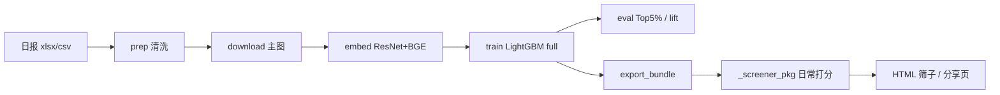

# Temu 选品排序 · 实验场 + 日常筛子

> **给 Codex / 新同事的一份复现说明书**  
> 目标：用 **909–911 三天日报** 训练排序模型，验证 **时间外推**，再打包成 **每日可跑的选品工具**（打分 · 违禁词 · 可分享 HTML）。

---

## 一眼看懂仓库结构

```
├── rank_products.py          # 主流水线：prep → download → embed → train → eval
├── validate_temporal.py      # 909+910 训练 → 911 测新品（无 source 特征）
├── export_bundle.py          # 导出 LightGBM → _screener_pkg/model/
├── bootstrap_screener.py     # 同步 _screener_pkg → 桌面「选品筛子」
├── filter_download_csv.py      # 日报：去重 / 无收录 / 剔训练库 / 违禁
├── _screener_pkg/              # ★ 日常工具（可单独拷贝使用）
│   ├── model/                  # lgbm_full.txt + 特征清单 + cat_l2_te
│   ├── words/                  # 违禁词表
│   ├── src/run.py              # 唯一入口
│   └── config.json             # 缓存路径（相对路径，可改）
├── artifacts_v2/               # 实验指标、报告、HTML（不含大二进制见 .gitignore）
├── PLAN_rank_products.md       # 实验规格（权威）
├── TASK_temporal_validation.md
└── TASK_pack_screener.md
```



---

## 0. 环境（Windows，照抄可跑）

| 项 | 值 |
|----|-----|
| Python | **3.10**，推荐已有 CUDA 的 venv（示例：`F:\Clip\venv`） |
| 不要用 | 系统自带 CPU-only torch（PLAN 里写过会踩坑） |
| `HF_HOME` | 指向已有 `bge-small-zh-v1.5` 缓存（示例：`F:\Clip\hf-cache`） |
| 离线 | `HF_HUB_OFFLINE=1`（缺文件再临时关掉） |

```powershell
$env:HF_HOME = "F:\Clip\hf-cache"
$env:HF_HUB_OFFLINE = "1"
$env:OMP_NUM_THREADS = "1"   # LightGBM 在 Windows 上建议开，减少 access violation
$PY = "F:\Clip\venv\Scripts\python.exe"
```

**依赖（实验场）**：`torch`, `torchvision`, `sentence-transformers`, `lightgbm`, `pandas`, `openpyxl`, `aiohttp`, `Pillow`, `scipy`, `scikit-learn`  

**筛子额外**：`zhconv`（繁简归一化违禁词）

```powershell
& $PY -m pip install zhconv
```

---

## 1. 数据准备（本地，不进 Git）

在仓库根目录放三天导出（**后缀 csv 也是 xlsx**）：

| 文件 | 说明 |
|------|------|
| `909.xlsx` | 第一天 |
| `910.csv` | 第二天 |
| `911.csv` | 第三天 |

统一读取方式（**禁止** `pd.read_csv` 读 910/911）：

```python
pd.read_excel(path, sheet_name="sheet", header=[0, 1])
```

表头两行 MultiIndex，需压平（见 `rank_products.flatten_columns`）。

---

## 2. 实验流水线 `rank_products.py`

```powershell
cd <本仓库根目录>

# 分阶段（推荐，可断点续跑）
& $PY rank_products.py prep
& $PY rank_products.py download      # aiohttp 并发 200，Referer temu.com
& $PY rank_products.py embed         # ResNet18 + BGE，写出 artifacts_v2/img.npz + txt.npz
& $PY rank_products.py train         # 店铺分组切分 + full 模型
& $PY rank_products.py eval

# 或一次性
& $PY rank_products.py all
```

### 2.1 硬性约束（违反 = 泄漏）

- **禁止店铺列进特征**（`店铺ID` 只用于 Group 切分）
- **禁止** 销量/GMV/收录时间/美区评分等进特征
- Label：`y = log1p(clip(总销量, 0, train_p99.5))`，**不要** 0/1 分类
- 主指标：**Top 5% 精度 × 基线**、paired `lift@5`、Spearman（见 `artifacts_v2/metrics_top5pct.json`）

### 2.2 产物

| 路径 | 内容 |
|------|------|
| `artifacts_v2/dataset.csv` | 清洗后表格特征 |
| `artifacts_v2/img.npz` / `txt.npz` | 512d 向量 |
| `artifacts_v2/test_scores.npz` | 各组 test 预测（本地 train 后生成，默认 gitignore） |
| `artifacts_v2/report.md` | 文字报告 |

---

## 3. 时间外推 `validate_temporal.py`

**问题**：混三天 + 按店铺切分 ≠ 「用前两天挑第三天新品」。

```powershell
& $PY validate_temporal.py
```

- 读已有 `dataset.csv` + `img.npz` + `txt.npz`
- train = 909+910，test = 911，并做 ID/URL/标题/图 cosine 去重
- **`CAT_COLS` 仅 `cat_l2`（无 `source`）**
- 产出：`artifacts_v2/temporal_metrics.json`、`temporal_validation.md`、HTML 可选 `build_temporal_validation_html.py`

**结论口径（示例）**：看 **×基线**，不是绝对 Top5%（911 动销基线更高）。当前档 **B**：按天约为店铺切分效果的 ~八成。

---

## 4. 打包日常工具 `_screener_pkg`

### 4.1 导出模型（只需做一次，或 artifacts 更新后重做）

```powershell
& $PY export_bundle.py
```

- 从 `artifacts_v2/lgbm_full.pkl` 导出 **`lgbm_full.txt`**（禁止 pickle 分发）
- 写入 `_screener_pkg/model/`：`feature_names.json`, `cat_l2_te.json`, `y_cap.json`, `meta.json`
- **注意**：LightGBM `save_model` 在**中文路径**会失败；脚本会先写到 `F:\Clip\screener_lgb_export\`

### 4.2 同步到桌面（可选）

```powershell
& $PY bootstrap_screener.py
# → C:\Users\<你>\Desktop\选品筛子
```

### 4.3 每日跑数

```powershell
cd <仓库>\_screener_pkg
$env:HF_HOME = "F:\Clip\hf-cache"
$env:HF_HUB_OFFLINE = "1"
& $PY src\run.py --input "D:\downloads\某日.csv"    # 会先 download 主图
# 跳过下载（已有缓存）：
& $PY src\run.py --input "..\911.csv" --skip-download --self-test
```

**推理约定**

- 特征 `source` **固定填 `911.csv`**（meta 里写明）；新文件名不要喂进类别
- 未见 `cat_l2` → `cat_l2_te.json` 的 `_global`
- 主图失败：**不删行**，`img_missing=1`，HTML 仍用 **CDN URL** 显示图

**产出**

| 文件 | 用途 |
|------|------|
| `output/*_scored.csv` | 全量打分 |
| `output/*_screener.html` | 本地筛：价格、Top%、违禁、分页 |
| `output/*_分享.html` | 发朋友：Top5% 静态卡片 + **价格筛选**，https 主图直链 |

### 4.4 Windows 踩坑

| 现象 | 处理 |
|------|------|
| Torch 同进程后 LightGBM `access violation` | `score.py` 已在**子进程**里 `Booster.predict` |
| 中文路径存模型失败 | 使用 `config.json` → `lgb_model_ascii_fallback` |
| Top5% 一片「无图」 | 多为**未本地缓存**；分享页已改为直接用 `img.kwcdn.com` URL |

---

## 5. 日报前置清洗 `filter_download_csv.py`

```powershell
& $PY filter_download_csv.py --input "C:\path\日报.csv"
```

默认链路（可在脚本里改 `inp`）：

1. `商品ID` 去重  
2. 去掉 **训练折** 已出现：ID / 主图 URL / 标题（对照 `artifacts_v2/dataset.csv` + `dataset_embedded.csv`）  
3. 只保留 **无收录时间**  
4. 违禁词子串匹配（`words/违禁词与侵权.txt`）→ **剔除**命中行  

再交给 `run.py` 打分。

---

## 6. 其它脚本（按需）

| 脚本 | 作用 |
|------|------|
| `score_external_one.py` | 外测 CSV 打分 + label 压力 |
| `manual_audit_sample.py` | 500 条人工审核 HTML |
| `build_label_stress_html.py` | 外测 label 压力报告 |
| `audit_eval.py` / `audit_temporal.py` | 审计辅助 |

---

## 7. 复现检查清单（Codex 自检）

- [ ] 三天数据在根目录，910/911 用 `read_excel`  
- [ ] `HF_HOME` 下能加载 `BAAI/bge-small-zh-v1.5`  
- [ ] `prep → download → embed → train → eval` 跑通  
- [ ] `validate_temporal.py` 生成 `temporal_validation.md`  
- [ ] `export_bundle.py` 后 `_screener_pkg/model/lgbm_full.txt` 存在  
- [ ] `run.py --self-test` 与 `test_scores.npz` Spearman ≥ 0.95（需本地 train 出 npz + `config` 指向 `../artifacts_v2`）  
- [ ] 分享 HTML 顶栏价格筛选可用  

---

## 8. 推送到 GitHub（Spacexist）

本机首次推送：

```powershell
cd <仓库根目录>
gh auth login -h github.com    # token 过期时必做
gh repo create temu-product-rank --public --source=. --remote=origin --description "Temu 选品排序实验与日常筛子"
git add -A
git commit -m "docs: 完整复现说明与选品筛子工具链"
git push -u origin main
```

若仓库已存在，只改 remote：

```powershell
git remote add origin https://github.com/Spacexist/temu-product-rank.git
git push -u origin main
```

**不要提交**：原始 xlsx/csv、`hit_cache/images`、`img.npz`/`txt.npz`（见 `.gitignore`）。  
模型 **`lgbm_full.txt`** 在 `_screener_pkg/model/` 内，体积可接受则一并提交，否则在新环境 `export_bundle.py` 重导。

---

## 9. 关键结论（给产品/运营，非训练必读）

| 场景 | 说法 |
|------|------|
| 域内（店铺切分） | full Top5% P(>0) ×基线 ≈ **2.5** |
| 按天外推 911 | ×基线 ≈ **2.0**（**B**：能用，预期打八折） |
| 日常用法 | **筛 Top 5–10% + 人工**，违禁/无图谨慎上架 |

更细：`artifacts_v2/OPUS5_REVIEW_REPORT.md`、`选品模型完整报告.md`。

---

## License

内部项目；数据与日报含商业信息，勿公开原始 CSV。
