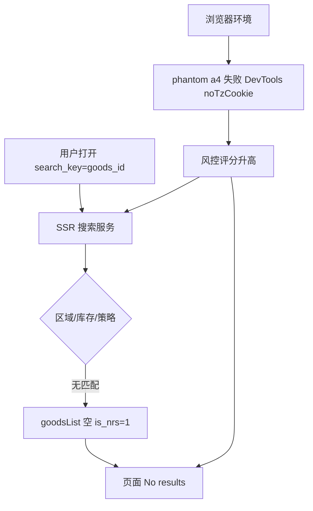

# Temu 搜索无结果与风控信号排查汇报

**汇报日期：** 2026-09-12  
**分析材料：**

- `C:\Users\ZFGJ-WCH\Downloads\www.temu.com.har`（约 2.2 MB，154 条网络记录）
- `C:\Users\ZFGJ-WCH\Downloads\Temu.html`（搜索结果页离线保存及 `Temu_files` 前端资源）
- 业务侧选品链接样例：`search_result.html?search_key=605773392409873&search_method=user`

**问题现象：** 在 Temu 日本站（英文界面、JPY）搜索商品 ID `605773392409873` 时，页面显示「No results」，用户怀疑遭遇持续「风控」。

---

## 一、结论摘要

1. **本次抓包未出现典型「风控弹窗」**（如 *unusual activity* / `risk_result_sub_title`），表现为**搜索无结果（软降级）**：服务端在 SSR 阶段即写入 `goodsList: []`、`is_nres: 1`。
2. **账号未被整体封禁**：Google 登录成功，购物车合并、侧边栏购物车等接口均返回 `success: true`，购物车仍有 22 件商品。
3. **环境存在多项风控弱信号**：DevTools 检测、时区 Cookie 缺失、`phantom` 指纹接口 `a4` 未完成、区域/时区/语言不一致、搜索前强制登录（`login_scene=2`）等，会提高搜索被降权或返回空结果的概率。
4. **业务链接形态存在结构性风险**：选品系统使用 **`search_key=<goods_id>`** 跳转搜索页，该方式在 JP 站 + 已登录场景下**不稳定**，易与「区域无货 / 搜索不支持纯 ID」混淆，造成「像一直被风控」的体感。

**综合判断：** 当前问题 = **搜索链路无结果（服务端判定）** + **高风险测试环境** + **链接用 ID 当搜索词** 三者叠加；不能单凭页面文案断定账号被硬风控，但应尽快规范环境与链接策略。

---

## 二、分析范围与方法

| 步骤 | 说明 |
|------|------|
| HAR 解析 | 统计 API 路径、状态码、失败请求、PMM 自定义事件 |
| HTML SSR 解析 | 提取 `window.rawData.store` 中搜索态、登录态、布局态 |
| 前端资源对照 | 对照 `search_result` 相关 chunk；确认文案与状态字段来源 |
| 业务数据对照 | 对照选品 CSV/HTML 中 `605773392409873` 与生成链接格式 |

---

## 三、关键事实（证据链）

### 3.1 服务端搜索状态（`Temu.html` → `window.rawData`）

| 字段 | 值 | 解读 |
|------|-----|------|
| `searchKey` | `605773392409873` | 与 URL 一致 |
| `goodsList` | `[]` | 无商品 |
| `searchEventInfo.is_nres` | `1` | 埋点：无结果（no result） |
| `p_search` / `pSearch` | 空字符串 | 正常有结果时通常带检索追踪串 |
| `isLogin` | `true` | 已登录 |
| `localInfo` | region `100`，language `en`，currency `JPY`，timezone `Asia/Shanghai` | JP 站 + 上海时区 |
| `layoutData.commonData.noTzCookie` | `true` | 缺少时区相关 Cookie |
| `layoutData.commonData.dr` | `us` | 数据路由标记与 JP 区域并存 |
| `isRobot` | `false` | 未标记为爬虫 |

页面展示的 *No results for "605773392409873"* 与 SSR 数据一致，**非纯前端渲染异常**。

### 3.2 网络层（HAR）

- **无 HTTP 4xx/5xx 业务失败**：`failed count: 0`（业务 API 层面）。
- **未观察到主搜索商品列表 API**（如带完整 `goods_list` 的 poppy 主搜索 XHR）；与搜索相关的请求主要为：
  - `POST /api/poppy/v1/search_suggest`：`query=605773392409873`，`success: true`，响应体无有效商品推荐列表；
  - `POST /api/poppy/v2/search_activation`：热门推荐词，与目标 ID 无关。
- **说明：** 商品列表在打开 `search_result.html` 时已在 **SSR/首屏数据** 中确定，本段 HAR 内客户端未再发起主搜索刷新。

### 3.3 账号与交易相关接口（正常）

| 接口 | 结果 |
|------|------|
| `POST /api/bg/sigerus/auth/login` | `success: true`，Google 登录成功 |
| `POST /api/bg/bg-uranus-api/uranus_cart/merge` | `success: true` |
| `POST /api/bg/bg-uranus-api/uranus_cart/cart_modify/pc_side_bar` | `success: true`，侧边栏购物车可展示 |

### 3.4 风控 / 指纹相关（异常或弱信号）

| 项目 | 现象 | 风险含义 |
|------|------|----------|
| `POST /api/phantom/xg/pfb/a4` | 共 6 次，**status 0，无响应体** | 设备指纹上报链未完成，常见于插件拦截、请求被取消、异常浏览环境 |
| `phantom` 其他节点 a3/b/l1 | 200 成功 | 部分指纹仍成功 |
| 登录等请求 | 请求头含 `Anti-Content` | 与拼多多系一致的反爬/签名校验体系 |
| PMM：`custom_isDevToolOpen` | `true`，`detectByWindowWidth` | 检测到 DevTools（宽窗口检测） |
| PMM：`no_tz_cookie_detected` | 已上报 | 与 `noTzCookie: true` 一致 |
| PMM：`cart_cache_invalid_auth` | `custom_errorCode: -1`，`custom_isLogin: 1` | 登录态与购物车本地缓存校验不一致 |
| 行为链 | `login_scene=2`，先登录再回搜索 | 搜索触发强制登录场景 |
| HTML 属性 | `data-dragonfly-bridge-injected` | 存在桥接/注入脚本痕迹（扩展或自动化） |
| HAR 其他 | 部分请求 `ERR_BLOCKED_BY_CLIENT` | 客户端拦截（多为广告/隐私插件） |

### 3.5 业务链接形态

选品分享页与 CSV 使用统一模板：

```text
https://www.temu.com/search_result.html?search_key={goods_id}&search_method=user
```

样例商品 `605773392409873` 在训练库中为有效 goods_id（家居类 SKU），但 **Temu 搜索页未必将 goods_id 当作可检索关键词**，尤其在 **region=100（日本）** 下易直接 `is_nres=1`。

---

## 四、原因分析（分层）



1. **直接原因（产品层）：** 服务端对当前 query + region + 登录场景返回 **零结果**，并由前端展示标准无结果文案（含库存/区域说明）。
2. **放大原因（环境层）：** 指纹不完整、DevTools、时区 Cookie 缺失、区域与时区/语言/`dr` 不一致，增加搜索被保守处理的概率。
3. **误判原因（业务层）：** 用 **搜索 URL + 数字 ID** 代替商品详情或关键词搜索，失败时容易被统一归咎于「风控」。

---

## 五、与「一直风控」的对应关系

| 用户体感 | 技术事实 |
|----------|----------|
| 搜什么都像没货 | 需区分：是全部 query 无结果，还是仅 ID 搜索无结果 |
| 登录后仍无结果 | 登录成功 ≠ 搜索解禁；本次为 `is_nres` 无结果路径 |
| 购物车正常 | 与「整号封禁」不符，更符合 **搜索子系统降权/无结果** |
| 开 F12 更明显 | 与 `isDevToolOpen` 上报一致，建议作为复现变量 |

---

## 六、建议措施

### 6.1 短期（验证用，1～2 天）

1. **干净环境复测：** 关闭 DevTools、关闭广告/隐私拦截、移除 Dragonfly 等自动化扩展；对 `*.temu.com`、`*.kwcdn.com` 放行。
2. **区域一致性：** JP 站使用 JP 出口 + 浏览器语言/时区与站点一致，复测后确认 PMM 是否仍出现 `no_tz_cookie_detected`。
3. **同一 SKU 三种打开方式对比：**
   - `search_key=605773392409873`
   - 商品标题关键词（英文/日文）
   - 区域化商品详情 URL（若可获取）
4. **再抓 HAR：** 重点看 `phantom/xg/pfb/a4` 是否 200，以及 SSR 中 `is_nres` 是否仍为 1。

### 6.2 中期（产品/研发）

1. **选品外链策略调整：** 避免默认 `search_result.html?search_key={goods_id}`；优先详情页或带 `goods_id` 参数的规范商品链（需按 Temu 各区域 URL 规则调研）。
2. **监控字段标准化：** 对批量排查记录 `is_nres`、`noTzCookie`、`login_scene`、`p_search` 是否为空、`a4` 状态。
3. **区域字段对齐：** 爬取/定价若绑定特定 region，前端打开链接应带一致 region（如 `/jp-en/`），减少跨区 ID 失效。

### 6.3 不建议

- 在未解决环境与链接问题前，投入大量精力逆向 `Anti-Content` / `phantom`（成本高、易失效、合规风险）。
- 将单次「No results」等同于账号永久风控，忽视 JP 库存与 ID 搜索限制。

---

## 七、附录

### A. 主要 API 清单（本 HAR）

- 指纹：`/api/phantom/xg/pfb/a3|a4|b|l1`，`/api/phantom/dm/wl/cg`
- 登录：`/api/bg/sigerus/auth/login`
- 设备：`/api/bg/tampa/web_device/record`
- 购物车：`/api/bg/bg-uranus-api/uranus_cart/*`
- 搜索辅助：`/api/poppy/v1/search_suggest`，`/api/poppy/v2/search_activation`

### B. 本地分析脚本（可选复用）

- `8天前数据\_har_analyze_temu.py`
- `8天前数据\_parse_temu_html.py`

### C. 关联业务文件

- `2098682172555476993_无收录_去重训练库_无违禁_scored.csv` 中 goods_id `605773392409873`
- `Downloads\2098682172555476993_无收录_去重训练库_无违禁_分享.html` 中同类搜索链接

---

**汇报人：** AI 辅助排查（基于用户提供的 HAR/HTML）  
**后续如需：** 可基于本模板对多个 goods_id 批量出「无结果 vs 环境异常」分类表。
